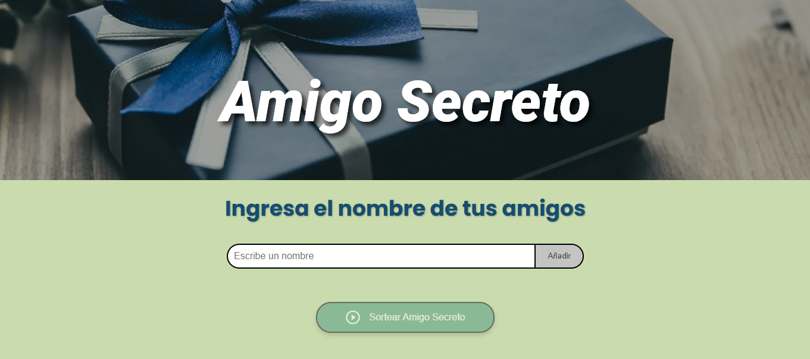
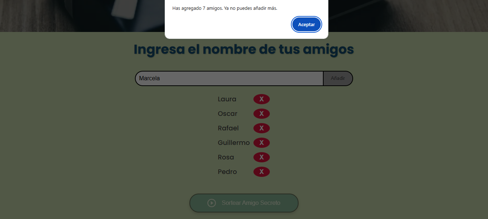
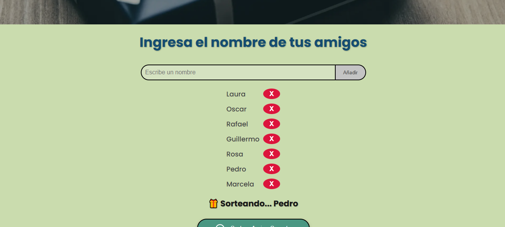
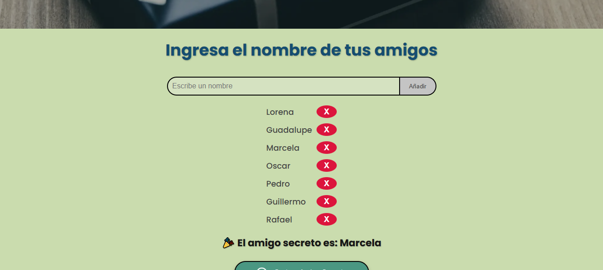

# 🎁 Juego de Amigo Secreto

Este proyecto es una aplicación web interactiva para realizar sorteos de "amigo secreto", común en celebraciones navideñas o de fin de año. La aplicación permite ingresar nombres, validarlos, eliminarlos y sortear aleatoriamente un amigo secreto con una animación estilo ruleta 🎰.

## 🧠 Funcionalidades principales

- Ingreso de nombres con validaciones estrictas.
- Límite máximo de 7 participantes.
- Eliminación individual de nombres.
- Animación de ruleta para elegir al amigo secreto.
- Reinicio automático después del sorteo.

## 🧪 Validaciones implementadas

- ❌ Nombres vacíos o con caracteres no válidos (números, espacios, símbolos) no son aceptados.
- 🔁 No se permiten nombres duplicados.
- 📋 No se puede pegar texto inválido en el input.
- 🔒 Una vez agregado el máximo de 7 amigos, se deshabilitan el input y el botón de añadir.
- 🎉 Tras el sorteo, se bloquean nuevas interacciones hasta el reinicio automático.

## 🖱️ Funcionamiento de los botones

### ➕ Botón "Añadir"

- Añade un nuevo amigo a la lista.
- Aparece una alerta si el nombre no es válido.
- Se desactiva si ya hay 7 amigos en la lista.

### ❌ Botón "X" junto a cada nombre

- Elimina al amigo correspondiente.
- Si se elimina uno, vuelve a habilitar el campo de entrada (si estaba bloqueado).

### 🔄 Botón "Sortear Amigo Secreto"

- Activa una animación tipo ruleta mostrando nombres aleatorios.
- Después de unos segundos, muestra el resultado final.
- Reinicia automáticamente el juego después de 5 segundos.

## 💻 Tecnologías utilizadas
- **HTML5** 
- **CSS3** 
- **JavaScript**

## 📸 Capturas de pantalla

### 1. Agregando nombres

### 2. Sorteo en proceso

### 3. Resultado final

---

## 👨‍💻 Autor

**Erick Ernesto**  
[@ernestodev079](https://github.com/ernestodev079)

